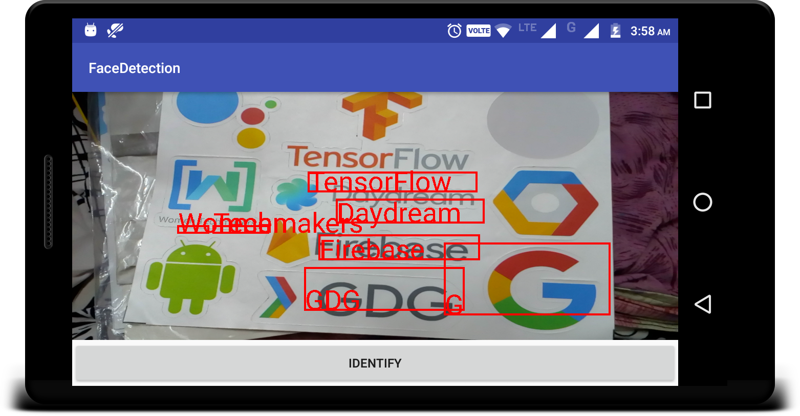
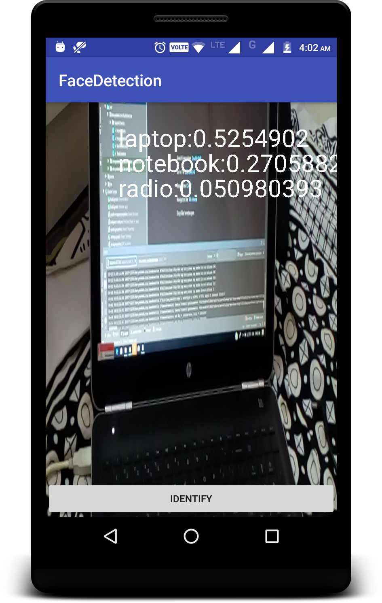
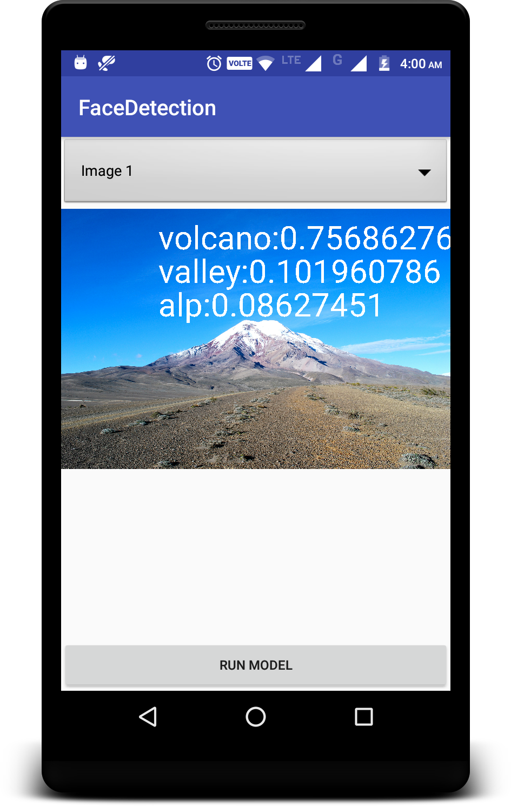

# ML KitE 
Implementation of Google ML Kit

# Project Overview
In this i have tried implementing ML KIT 2 features
* Text Recognition
* Image Recognition with custom mode
# Requirement
* Firebase setup'd project 
* Tensor Flow Model
* Mehnat xD 
 various Resources from where i have learnt : 
 * https://firebase.google.com/docs/ml-kit/recognize-text \n
 * https://firebase.google.com/docs/ml-kit/android/use-custom-models
 * Google Codelabs 
 
## Final Output - Screenshots

* #Text Recognition                          
  
* #Image Recognition                          
 
 

